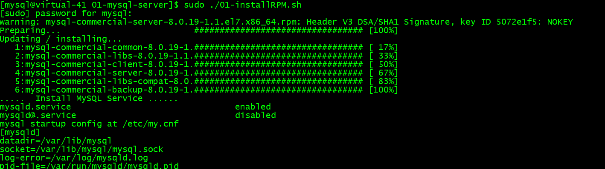
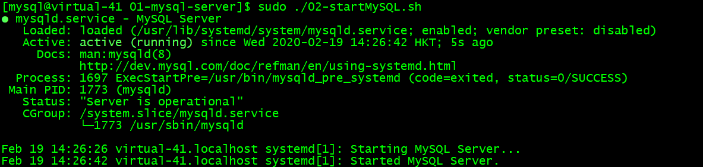
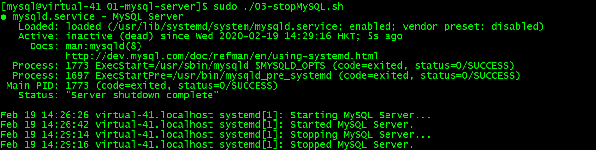
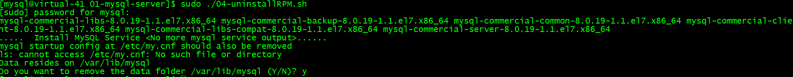

# MySQL Installation
In this lab, we will install MySQL using rpm and tar methods. First of all, we will install MySQL using rpm followed by custom install using tar
## MySQLnode1 Installation
All the MySQL insatll files are kept in /opt/download/mysql. The installation scripts are stored in /opt/download/lab with sub-directories with all the lab files labeled with number, such as 01-install, 02-Admin, etc

### RPM installation
1. Install MySQL by executing the scripts in /opt/download/lab/01-install
```
cd /opt/download/lab/01-install
ls
cd 01-mysql-server
sudo ./01-installRPM.sh
```



2. Start MySQL (initialization and start-up MySQL)
```
sudo ./02-startMySQl.sh
```



3. Once MySQL is started, you can explore the system to find out where are the MySQL data directory, binaries, etc
``` 
rpm -ql mysql-commercial-server-8.0.19-1.1.el7.x86_64
cd /usr/sbin
cd /etc
cd /var/lib
cd /usr/bin
cd /usr/lib/systemd/system/
```

4. Stop MySQL
```
sudo ./03-stopMySQL.sh
```



5. Unstall MySQL RPM
```
sudo ./04-uninstallRPM.sh
```



6. Now install MySQL using tar
```
sudo ./05-installTAR.sh
```


7. MySQL is now installed in /opt/mysql-commercial-8.0.19-el7-x86_64
```
cd /opt/mysql-commercial-8.0.19-el7-x86_64
ls
cd /usr/local/mysql
ls
```
8. You are ready to move to other labs


