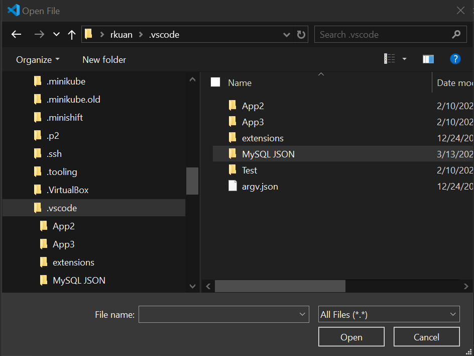

We will use Visual Studio Code (VS Code) on Windows to develop a simple Node.js application using MySQL. 
First, download and install Visual Studio Code from https://code.visualstudio.com/

Run VS Code, and create a new project "MySQL JSON" in your "C:\Users\<name>\.vscode" directory


Next, open a "Terminal"
```
npm -init
npm install @mysql/xdevapi --save --save-exact
npm install express --save
```


