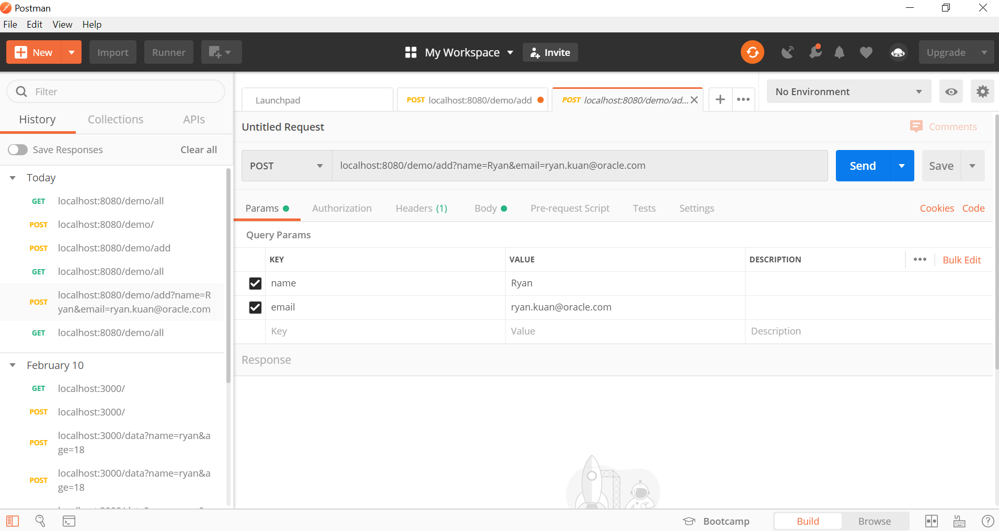

# Microservices using Spring Boot with MySQL
Microservices is adopted rapid among enterprises as a way to become more agile and flexible in rolling out new products and services
In this lab, we will use a very simple Spring Boot application to store and retrieve data in/from MySQL

## Create the skeleton Spring Boot application
Browse to http://start.spring.io to create the initial Spring Boot skeleton
Include the dependencies of **Web, Data JPA, MySQL**, generate the project zipfile


## Edit the code
Unzip the zipfile downloaded to a directory, and open the project in Eclipse


Edit the following java classes:

AccessingDataMysqlApplication.java
```
package com.example.accessingdatamysql;

import org.springframework.boot.SpringApplication;
import org.springframework.boot.autoconfigure.SpringBootApplication;

@SpringBootApplication
public class AccessingDataMysqlApplication {

  public static void main(String[] args) {
    SpringApplication.run(AccessingDataMysqlApplication.class, args);
  }

}
```

MainController.java
```
import org.springframework.web.bind.annotation.ResponseBody;

@Controller // This means that this class is a Controller
@RequestMapping(path="/demo") // This means URL's start with /demo (after Application path)
public class MainController {
  @Autowired // This means to get the bean called userRepository
         // Which is auto-generated by Spring, we will use it to handle the data
  private UserRepository userRepository;

  @PostMapping(path="/add") // Map ONLY POST Requests
  public @ResponseBody String addNewUser (@RequestParam String name
      , @RequestParam String email) {
    // @ResponseBody means the returned String is the response, not a view name
    // @RequestParam means it is a parameter from the GET or POST request

    User n = new User();
    n.setName(name);
    n.setEmail(email);
    userRepository.save(n);
    return "Saved";
  }

  @GetMapping(path="/all")
  public @ResponseBody Iterable<User> getAllUsers() {
    // This returns a JSON or XML with the users
    return userRepository.findAll();
  }
}
```

MysqlDemoApplication.java
```
package com.example.accessingdatamysql;

import org.springframework.boot.SpringApplication;
import org.springframework.boot.autoconfigure.SpringBootApplication;

@SpringBootApplication
public class MysqlDemoApplication {

	public static void main(String[] args) {
		SpringApplication.run(MysqlDemoApplication.class, args);
	}

}
```

User.java
```
package com.example.accessingdatamysql;

import javax.persistence.Entity;
import javax.persistence.GeneratedValue;
import javax.persistence.GenerationType;
import javax.persistence.Id;

@Entity // This tells Hibernate to make a table out of this class
public class User {
  @Id
  @GeneratedValue(strategy=GenerationType.AUTO)
  private Integer id;

  private String name;

  private String email;

  public Integer getId() {
    return id;
  }

  public void setId(Integer id) {
    this.id = id;
  }

  public String getName() {
    return name;
  }

  public void setName(String name) {
    this.name = name;
  }

  public String getEmail() {
    return email;
  }

  public void setEmail(String email) {
    this.email = email;
  }
}
```

UserRepository.java
```
package com.example.accessingdatamysql;

import org.springframework.data.repository.CrudRepository;

import com.example.accessingdatamysql.User;

// This will be AUTO IMPLEMENTED by Spring into a Bean called userRepository
// CRUD refers Create, Read, Update, Delete

public interface UserRepository extends CrudRepository<User, Integer> {

}
```

## Compile and Run the code
Once the code editing is done, build and run the application

```
cd \mysql-demo
mvnw spring-boot:run
```

## Test the application
You can use either **curl** or **Postman** to test the 2 services (GET, POST)

### Insert new record

Use **Postman** to add a new record



### Retrieve records
Use curl to GET from MySQL
```
curl GET localhost:8080/demo/all
```
### Check MySQL
You should see data is inserted into the database

```
mysql> select * from user;
+----+---------------------------------+-------+
| id | email                           | name  |
+----+---------------------------------+-------+
|  1 | someemail@someemailprovider.com | First |
|  2 | ryan.kuan@oracle.com            | Ryan  |
+----+---------------------------------+-------+
2 rows in set (0.00 sec)
```

Voila!
