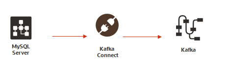
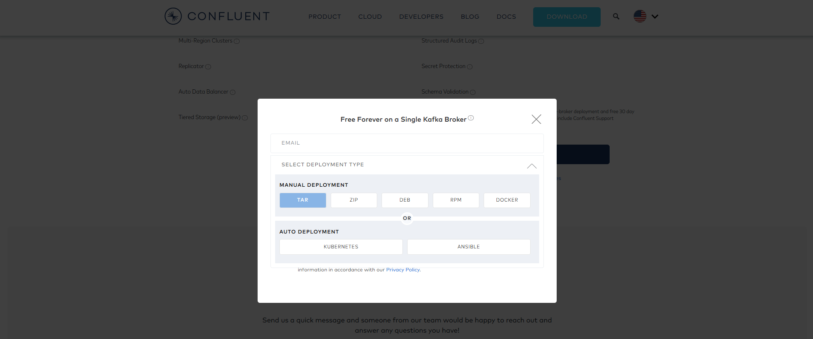

# Using Confluent Kafka with MySQL
Kafka is fast becoming one of the major components of cloud-native application architecture. In this lab, we will use Confluent Kafka to ingest data from MySQL to Kafka using Kafka Connect and Debezium 



## 1. Using Kafka Connect 

### Install Confluent Kafka
The prerequisite of Kafka is the JVM. 
Use the bundled JVM in MySQL, for example, export JAVA_HOME=/usr/local/mysql/enterprise/agent/java

### Confluent Platform Community 
We will install Confluent Platform Community Edition, Confluent Hub Client, Kafka Connect Datagen
First of all, download **Confluent Platform Community Editon** from https://www.confluent.io/download. 
Select the TAR version in the Deploymnet Type


Once downloaded, untar the file
```
cd /opt
sudo tar zxvf /tmp/confluent-community-6.2.0.tar.gz
sudo ln -s /opt/confluent-6.2.0 /usr/local/kafka
```
### Confluent Hub Client
Install confluent hub client from https://docs.confluent.io/current/connect/managing/confluent-hub/client.html#hub-linux. Just download and unzip the client


### Configure Confluent Kafka
Once everything is installed, set up the environment
```
vi ~/.bash_profile
export CONFLUENT_HOME=/usr/local/kafka
export JAVA_HOME=/usr/local/mysql/enterprise/agent/java
export PATH=$PATH:$CONFLUENT_HOME/bin:$JAVA_HOME/bin
```
### Install kafka connect datagent
```
confluent-hub install \
--no-prompt confluentinc/kafka-connect-datagen:latest
```
### Install kafka connect jdbc
```
confluent-hub install confluentinc/kafka-connect-jdbc:latest
```

### Install confluent cli
```
wget https://s3-us-west-2.amazonaws.com/confluent.cloud/confluent-cli/archives/latest/confluent_latest_linux_amd64.tar.gz
tar zxvf confluent_latest_linux_amd64.tar.gz
```

## Configure Kafka Connect to MySQL
MySQL JDBC driver should be downloaded and installed

### Install mysql connector for java
Download the latest JDBC driver from https://dev.mysql.com/downloads/connector/j/
Unzip the file and make sure the driver is also at confluent jdbc directory
``` 
cd /opt
unzip /tmp/mysql-connector-java-8.0.19.zip
cd $CONFLUENT_HOME/share/java/kafka-connect-jdbc
ln -s /opt/mysql-connector-java-8.0.19/mysql-connector-java-8.0.19.jar .
```

### Start Kafka
Once the MySQL JDBC driver is installed, Kafka connect will load the MySQL JDBC driver during startup
```
confluent local start
```
You should see kafka is started
```
Starting zookeeper
zookeeper is [UP]
Starting kafka
kafka is [UP]
Starting schema-registry
schema-registry is [UP]
Starting kafka-rest
kafka-rest is [UP]
Starting connect
connect is [UP]
Starting ksql-server
ksql-server is [UP]
```
### Prepare MySQL database
Create a simple table for testing
mysql>
```
create database ryan;
use ryan;
create table foobar \
(c1 int, \
c2 varchar(255), \
create_ts timestamp DEFAULT CURRENT_TIMESTAMP, \
update_ts timestamp DEFAULT CURRENT_TIMESTAMP ON UPDATE CURRENT_TIMESTAMP );
insert into foobar (c1,c2) values(1,'foo');
\q
```


### Configure MySQL conenction
We will create a simple JDBC connection properties to test Kafka connection to MySQL

### Edit "kafka-connect-jdbc-source.json"
```
cd /opt/download/lab/kafka
vi ./kafka-connect-jdbc-source.json 
```
The content of the json file as follow:
```
{
        "name": "jdbc_source_mysql_foobar_01",
        "config": {
                "_comment": "The JDBC connector class. Don't change this if you want to use the JDBC Source.",
                "connector.class": "io.confluent.connect.jdbc.JdbcSourceConnector",

                "_comment": "How to serialise the value of keys - here use the Confluent Avro serialiser. Note that the JDBC Source Connector always returns
null for the key ",
                "key.converter": "io.confluent.connect.avro.AvroConverter",

                "_comment": "Since we're using Avro serialisation, we need to specify the Confluent schema registry at which the created schema is to be stor
ed. NB Schema Registry and Avro serialiser are both part of Confluent Platform.",
                "key.converter.schema.registry.url": "http://localhost:8081",

                "_comment": "As above, but for the value of the message. Note that these key/value serialisation settings can be set globally for Connect and
 thus omitted for individual connector configs to make them shorter and clearer",
                "value.converter": "io.confluent.connect.avro.AvroConverter",
                "value.converter.schema.registry.url": "http://localhost:8081",


                "_comment": " --- JDBC-specific configuration below here  --- ",
                "_comment": "JDBC connection URL. This will vary by RDBMS. Consult your manufacturer's handbook for more information",
                "connection.url": "jdbc:mysql://localhost:3306/ryan?user=root&password=mysql",

                "_comment": "Which table(s) to include",
                "table.whitelist": "foobar",

                "_comment": "Pull all rows based on an timestamp column. You can also do bulk or incrementing column-based extracts. For more information, see http://docs.confluent.io/current/connect/connect-jdbc/docs/source_config_options.html#mode",
                "mode": "timestamp",

                "_comment": "Which column has the timestamp value to use?  ",
                "timestamp.column.name": "update_ts",

                "_comment": "If the column is not defined as NOT NULL, tell the connector to ignore this  ",
                "validate.non.null": "false",

                "_comment": "The Kafka topic will be made up of this prefix, plus the table name  ",
                "topic.prefix": "mysql-"
        }
}
```
### Load the JDBC connection 
```
cd $CONFLUENT_HOME
bin/confluent local load jdbc_source_mysql_foobar_01 -- -d /opt/download/lab/kafka/kafka-connect-jdbc-source.json
bin/confluent local status jdbc_source_mysql_foobar_01
```
You should see the driver successfully loaded and running
```
{
  "name": "jdbc_source_mysql_foobar_01",
  "connector": {
    "state": "RUNNING",
    "worker_id": "127.0.0.1:8083"
  },
  "tasks": [
    {
      "state": "RUNNING",
      "id": 0,
      "worker_id": "127.0.0.1:8083"
    }
  ]
}
```
### Connect to Kafka and start streaming from MySQL
Use Terminal #1
Use avro-console-consumer to check the topics
```
./bin/kafka-avro-console-consumer \
--bootstrap-server localhost:9092 \
--property schema.registry.url=http://localhost:8081 \
--property print.key=true \
--from-beginning \
--topic mysql-foobar
```
You should see the following message
```
null    {"c1":{"int":1},"c2":{"string":"foo"},"create_ts":1501796305000,"update_ts":1501796305000}
```
Use Terminal #2
mysql>
```
use ryan;
insert into foobar (c1,c2) values(2,'foo');
insert into foobar (c1,c2) values(3,'foo');
update foobar set c2='bar' where c1=1;
```
On Terminal #1
You should see the following:
```
null    {"c1":{"int":1},"c2":{"string":"foo"},"create_ts":1501796305000,"update_ts":1501796305000}
null    {"c1":{"int":2},"c2":{"string":"foo"},"create_ts":1501796665000,"update_ts":1501796665000}
null    {"c1":{"int":3},"c2":{"string":"foo"},"create_ts":1501796670000,"update_ts":1501796670000}
null    {"c1":{"int":1},"c2":{"string":"bar"},"create_ts":1501796305000,"update_ts":1501796692000}
```

## 2. Using Debezium
**Debezium does not seem to work with 8.0.19, the official release only tested with 8.0.13, will try it out on older version later**

### Install Debezium MySQL connector
```
confluent-hub install debezium/debezium-connector-mysql:latest
The component can be installed in any of the following Confluent Platform installations:
  1. /opt/confluent-5.4.0 (found in the current directory)
  2. /usr/local/kafka (where this tool is installed)
Choose one of these to continue the installation (1-2): 1
Do you want to install this into /opt/confluent-5.4.0/share/confluent-hub-components? (yN) y


Component's license:
Apache 2.0
https://github.com/debezium/debezium/blob/master/LICENSE.txt
I agree to the software license agreement (yN) y

You are about to install 'debezium-connector-mysql' from Debezium Community, as published on Confluent Hub.
Do you want to continue? (yN) y

Downloading component Debezium MySQL CDC Connector 1.0.0, provided by Debezium Community from Confluent Hub and installing into /opt/confluent-5.4.0/share/confluent-hub-components
Detected Worker's configs:
  1. Standard: /opt/confluent-5.4.0/etc/kafka/connect-distributed.properties
  2. Standard: /opt/confluent-5.4.0/etc/kafka/connect-standalone.properties
  3. Standard: /opt/confluent-5.4.0/etc/schema-registry/connect-avro-distributed.properties
  4. Standard: /opt/confluent-5.4.0/etc/schema-registry/connect-avro-standalone.properties
  5. Based on CONFLUENT_CURRENT: /tmp/confluent.IgZcKDJX/connect/connect.properties
Do you want to update all detected configs? (yN) y

Adding installation directory to plugin path in the following files:
  /opt/confluent-5.4.0/etc/kafka/connect-distributed.properties
  /opt/confluent-5.4.0/etc/kafka/connect-standalone.properties
  /opt/confluent-5.4.0/etc/schema-registry/connect-avro-distributed.properties
  /opt/confluent-5.4.0/etc/schema-registry/connect-avro-standalone.properties
  /tmp/confluent.IgZcKDJX/connect/connect.properties

Completed
```

### Restart Kafka 
```
confluent local stop connect && confluent local start connect
```
Check if the Debezium connector is running
```
curl -sS localhost:8083/connector-plugins | jq .[].class | grep mysql
```
If the JSON processor is not installed (jq), install jq
```
sudo yum install jq
```

### Test connector to MySQL
Create a MySQL json configuration
```
{
 "name": "inventory-connector",
 "config": {
     "connector.class": "io.debezium.connector.mysql.MySqlConnector",
     "tasks.max": "1",
     "database.hostname": "mysql",
     "database.port": "3306",
     "database.user": "debezium",
     "database.password": "dbz",
     "database.server.id": "184054",
     "database.server.name": "dbserver1",
     "database.whitelist": "inventory",
     "database.history.kafka.bootstrap.servers": "localhost:9092",
     "database.history.kafka.topic": "schema-changes.inventory"
     }
 }
 curl -i -X POST -H "Accept:application/json" -H  "Content-Type:application/json" http://localhost:8083/connectors/ \
 -d @register-mysql.json
```
Start consuming messages from the topics
```
confluent local consume dbserver1.inventory.customers -- --from-beginning
```


Awesome!


