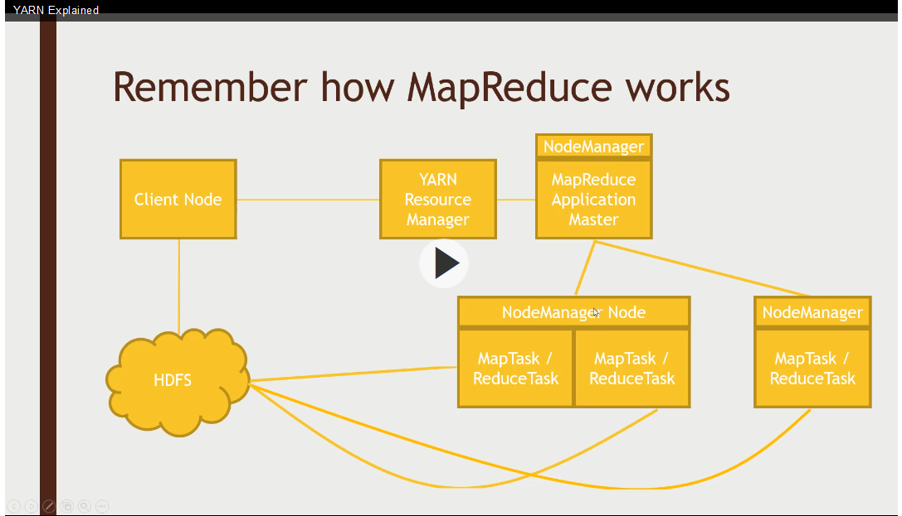

# Using Hortonworks Data Platform (HDP) with MySQL
Big Data using Hadoop technology has become the mainstream data analytics platform for ingesting massive amount of data from 
various sources, one of the major data sources is the transactional data such as MySQL. 

## Hadoop Architecture



Zookeeper Architecture


Play around with Zookeeper
```
cd /usr/hdp/current/zookeeper-client/bin
zkCli.sh
```
[zk: localhost:2181]
```
ls /
create -e /testmaster "127.0.0.1:2223" ## -e means ephemeral
get /testmaster
quit
zkCli.sh
ls /
get /testmaster
create -e /testmaster "127.0.0.1:2225"
```

### Kafka
```
cd /usr/hdp/current/kafka-broker/bin
kafka-topics.sh --create --zookeeper sandbox.hortonworks.com:2181 --replication-factor 1 --partition 1 --topic ryan
kafka-topics.sh --list -zookeeper sandbox.hortonworks.com:2181
kafka-console-producer.sh --broker-list sandbox.hortonworks.com:6667 --topic ryan
This is a message
This is anoterh message
```
On another terminal
```
cd /usr/hdp/current/kafka-broker
kafka-console-consumer.sh --bootstrap-server sandbox.hortonworks.com:6667 --topic ryan --from-beginning
This is a message
This is anoterh message
```


## Install Hortonworks Data Platform (HDP) Sandbox
Download and import HortonWorks Sandbox (for Virtualbox) from https://www.cloudera.com/downloads/hortonworks-sandbox.html
Once you downloaded, import the file into Virtualbox and launch the VM once imported into Virtualbox

Log into the URL displayed on the VM splash screen, http://localhost:1080 using user and password **(maria_dev/maria_dev)**


Click on **Launch Dashboard**, you will be taken to HDP homepage


## Download sample dataset
We will use a sample movie dataset for our lab. 
```
wget http://media.sundog-soft.com/hadoop/movielens.sql
wget http://media-sundog-soft.com/hadoop/ml-100k/u.data
wget http://media-sundog-soft.com/hadoop/ml-100k/u.item
```

## Create database in MySQL
```
mysql -uroot -phortonworks1
```
MySQL>
```
create database movielens;
set names 'utf8';
set character set utf8;
source movielens.sql;
create user ''@'localhost' identified by '';
grant all privileges on *.* to ''@'localhost';
```

## Import data from MySQL to Hadoop
Use sqoop to import from MySQL into Hadoop file system and import it to Hive. Sqoop is using MapReduce to sort the data and generate data file in HDFS
```
sqoop import --connect jdbc:mysql://localhost/movielens --driver com.mysql.jdbc.Driver --table movies --table movies -m 1 --hive-import
```
### Check the data file uploaded to HDFS
Log on to Hortonworks portal to check the imported data file
Select "File view", navigate to "/home/maria_dev/movies", open the file "part-m-00000"


### Explore the imported Hive table
Log on to HDP dashboard using user/password (maria_dev/maria_dev)
Select the "Hive View 2.0" on the top right corner of the dashboard


Viola!

## Using Python to work with HBase

Start HBase services using HDP Dashboard
Login to HDP VM and start the REST server
```
/usr/hdp/current/hbase-master/bin/hbase-daemon.sh start rest -p 8000 --infoport 8001
```
## Using Pig with HBase
HBase architecture consists of HBase Master to manage the HBase data stored in HDFS


Upload u.user to HDFS
```
hbase shell
create 'users', 'userinfo'
list

```
Download the hbase.pig script
```
wget https://media.sundog-soft.com/hadoop/hbase.pig
pig hbase.pig
```
Pig is using MapReduce to upload data
Check the data after the data is loaded into hbase
```
hbase shell
scan 'users'
disable 'users'
drop 'users'
```

## Cassadra
Cassadra is a NoSQL database with CQL language to query the data. Cassadra shard data into multiple nodes that manage a subset of the
sharded data. Cassadra organizes nodes in cluster


### Install Cassadra
```
yum install sci-utils
yum install centos-release-scl-rh
yum install python27
scl enable python27 bash
python -V
cd /etc/yum.repos.d/
vi datastax.repo
[Datastax]
name = Datastax for Cassadra
baseurl = http://rpm.datastax.com/community
enabled = 1
gpgcheck = 0
yum install dsc30
pip install cqlsh
service cassadra start
cqlsh --cqlversion="3.4.0"
```
cqlsh>
```
create keyspace movielens with replication = {'class"' 'SimpleStrategy', 'replication_factor':'1'} and durable_writes=true;
use movieles;
create table users (user_id int, age int, gender text, occupation text, zip text, primary key (user_id));
describe table users;
select * from users;
wget http://media.sundog-soft.com/hadoop/CassadraSpark.py
export SPARK_MAJOR_VERSION=2
spark-submit --packages datastax:spark-cassadra-connector:2.0.0-M2-s_2.11 CassadraSpark.py
```
csqlsh>
```
use movielens;
select * from users limit 10;
service cassadra stop
```
## Mongodb
```
export SPARK_MAJOR_VERSION=2
wget http://media.sundog-soft.com/hadoop/MongoSpark.py
spark-submit --packages org.mongodb-spark-connector_2.11:2.0.0 MongoSpark.py

## Drill
Import data into Hive
```

Import data into mongodb

Download and install Apache Drill
```
bin/drillbit.sh start -Ddrill.exec.http.port=8765
```
Point your browser to http://localhost:8765/
Configure Hive configuration


## Using Phoenix with HBase
Phoenix architecture


```
yum install phoenix
cd /usr/hdp/current/phoenix-client/bin
python sqlline.py
```
0: jdbc:phoenix>
```
!tables
create table if not exist us_population (state char(2) not null, city varchar not null, population bigint \
constraint my_pk primary key (state, city));
!tables
upsert into us_population values ("NY", "New York", 890998888);
upsert into us_population values ("CA", "Los Angles", 1890998888);
select * from us_population;
```


### Miscellaneous
If some of the hadoop services are not started, for example, the Name Node service (some errors saying safe mode)

login to VM as root
password: hadoop
you will be prompted to change the password, change the password to **hortonworks1** same as mysql
```
su hdfs
hdfs dfsadmin -safemode leave
Safe mode is OFF
```
Restart the services in the following order: HDFS, YARN, MapReduce


