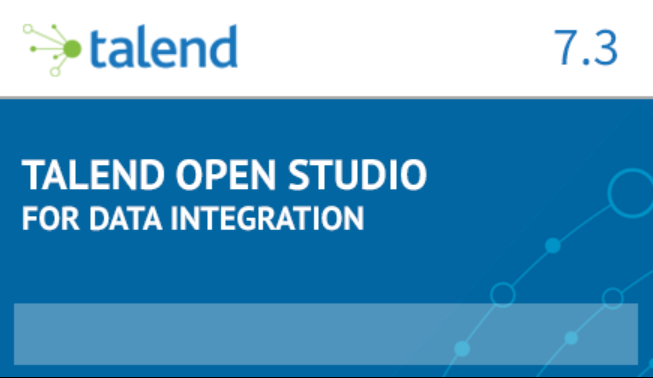

# Using Talend with MySQL
Talend is one of the fast-growing Data Integration solution to enable deep analytics and data integration requirements. 
In this lab, we will use Talend Open Studio to work with MySQL
## Install Talend Open Studio
Download and install Telend Open Studio on Windows from https://www.talend.com/products/talend-open-studio/
Talend Open Studio (TOS) is an Eclipse-based tools. 
### Install additional plugins
Once you have installed TOS, you will be prompted to install additional features/plugins. Go ahead to install the features

