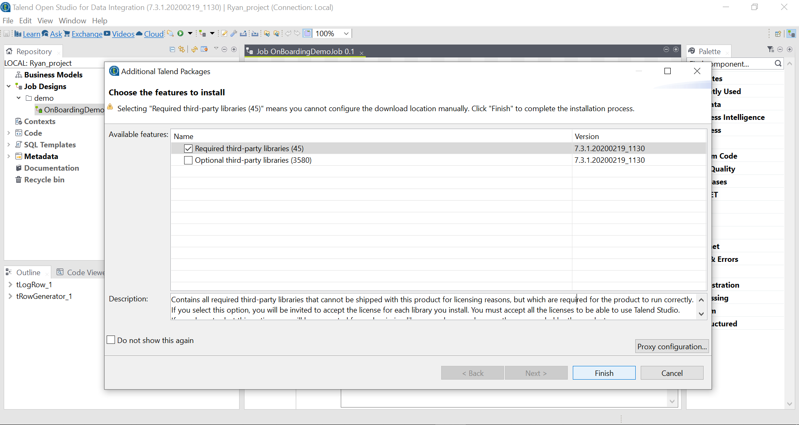
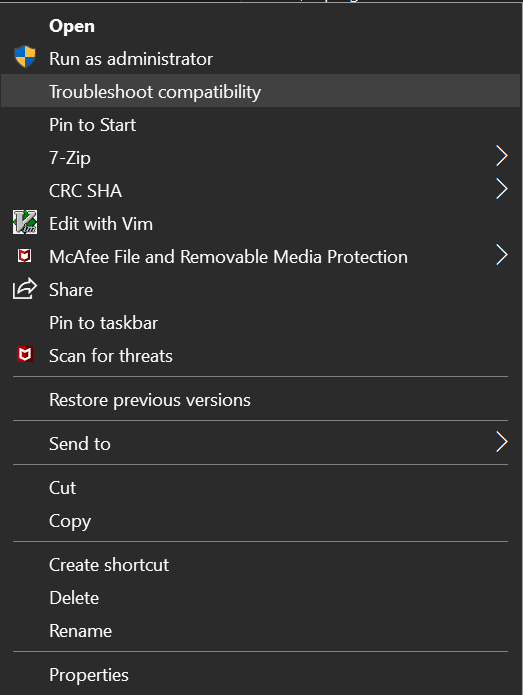

# Using Talend with MySQL
Talend is one of the fast-growing Data Integration solution to enable deep analytics and data integration requirements. 
In this lab, we will use Talend Open Studio to work with MySQL

## Prequisites
You must have JDK 1.8 installed, download and install from https://www.oracle.com/java/technologies/javase-jdk8-downloads.html

## Install Talend Open Studio
Download and install Telend Open Studio on Windows from https://www.talend.com/products/talend-open-studio/.
Talend Open Studio (TOS) is an Eclipse-based tools. 

### Install additional plugins
Once you have installed TOS, run TOS

You will be prompted to install additional features/plugins. Go ahead to install the **Required third-party libraries**. Optionally, you can install the **Optional third-party libraries** (It will take quite a bit of time to install both the third-party libraries)

### Fix compatibilities issues
If you are running Talend on Windows platform, some of the display panels don't display properly and you can't resize the panels.
You can run "Troubleshoot Compatibility" on the Talend program to have Windows fix the display issue.

