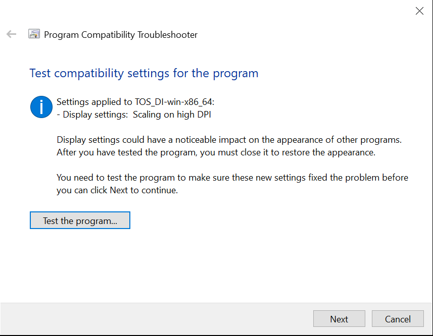

# Using Talend with MySQL
Talend is one of the fast-growing Data Integration solution to enable deep analytics and data integration requirements. 
In this lab, we will use Talend Open Studio to work with MySQL

## Prequisites
You must have JDK 1.8 installed, download and install from https://www.oracle.com/java/technologies/javase-jdk8-downloads.html
Simply create a batch file to specify the JDK 1.8 VM, for example, talend.bat
```
TOS_DI-win-x86_64.exe -vm "C:\Program Files\Java\jdk1.8.0_241\bin"
```

## Install Talend Open Studio
Download and install Telend Open Studio on Windows from https://www.talend.com/products/talend-open-studio/.
Talend Open Studio (TOS) is an Eclipse-based tools. 

### Install additional plugins
Once you have installed TOS, run TOS


You will be prompted to install additional features/plugins. Go ahead to install the **Required third-party libraries**. Optionally, you can install the **Optional third-party libraries** (It will take quite a bit of time to install both the third-party libraries)


### Fix compatibilities issues
If you are running Talend on Windows platform, some of the display panels don't display properly and you can't resize the panels.
You can run "Troubleshoot Compatibility" on the Talend program to have Windows fix the display issue.



## Create a JSON data set
Create a JSON data set by creating a new Metadata object, **File Json**
1. Specify a new of the Json, says **accounts**


2. Specify **Input Json**


3. Specify the JSON files, in this case, **accounts_noindex.json**


4. Specify the fields to be extracted. First, select **account_number** and drag it to the **Path Loop Expression** panel. 
Next select all the remaining fields, and drag them to the **Fields to extract** panel. Click on **Refresh Preview**


5. Review the last panel and click on **Finish**


## Create a DB Connection to MySQL
Create a DB Connection object to MySQL
1. Select **DB Connections**, right click to **Create connection**


2. Specify MySQL connection parameters and test the connection


## Create the data processing pipeline
Now it is time to use the 2 objects we created earlier to build a data processing pipeline
1. Select **accounts** (File Json object), **mysql** (DB Connections object), drop them to the **Job Designer** panel
2. Select **tLogRow** and **tMap** objects in the **Palette** on the right panel, drop them to the **Job Designer** panel
3. Wire up connections from **accounts** to **mysql**, we will just try to process 1 row

4 Finally, test the pipeline job! You should be able to see 1 row inserted to the **accounts** table in MySQL

```
mysql> create table accounts (balance int, firstname varchar(20), lastname varchar(20), age int, gender char(1), address varchar(30), employer varchar(20), email varchar(20), city varchar(6), state char(2), id smallint auto_increment primary key);
Query OK, 0 rows affected (0.32 sec)

mysql> select * from accounts;
+---------+-----------+----------+------+--------+-----------------+----------+----------------------+--------+-------+----+
| balance | firstname | lastname | age  | gender | address         | employer | email                | city   | state | id |
+---------+-----------+----------+------+--------+-----------------+----------+----------------------+--------+-------+----+
|   39225 | Amber     | Duke     |   32 | M      | 880 Holmes Lane | Pyrami   | amberduke@pyrami.com | Brogan | IL    |  1 |
+---------+-----------+----------+------+--------+-----------------+----------+----------------------+--------+-------+----+
1 row in set (0.00 sec)
```
Voila!


