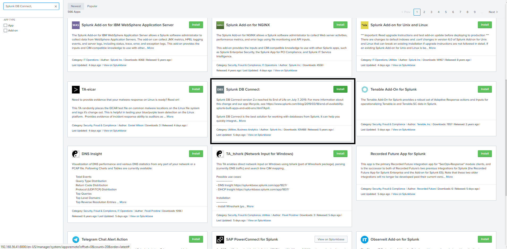

# Using Splunk with MySQL
Splunk is one of the most popular log analysis tools to analyze machines generated log files and data to help IT service organization
to manage their infrastructure and services better
## Install Splunk
First of all, we will download and install splunk from https://www.splunk.com/en_us/download/splunk-enterprise/. You are required to create a user id and password at splunk.com which you can use to install add-ons later.
```
cd /opt
tar zxvf /tmp/splunk-8.0.2.1-f002026bad55-Linux-x86_64.tgz 
sudo ln -s /opt/splunk /usr/local/splunk
cd /usr/local/splunk
bin/splunk start
```
Use "admin" and enter a password
```
Please enter an administrator username:
WARN: You entered nothing, using the default 'admin' username.
Password must contain at least:
   * 8 total printable ASCII character(s).
```
Once installed, you can point your browser to http://localhost:8000


Login with your id/password created during Splunk installation (admin)


## Install Splunk DB Connect
Click on Splunk App and search for "Splunk DB Connect", and clink on "Install"


You will be prompted for user id and password you created when downloading from splunk.com


You will be prompted to "Restart" after the installation
![restart[(img/S9.png)

Once restarted, click on "Splunk Apps" on Home page, click on "Spunk DB Connect"->"Configuration"->"Settings"
Enter the JVM location: /opt/mysql/enterprise/agent/java


Click on Drivers, 

## Install Splunk Add-on for MySQL


