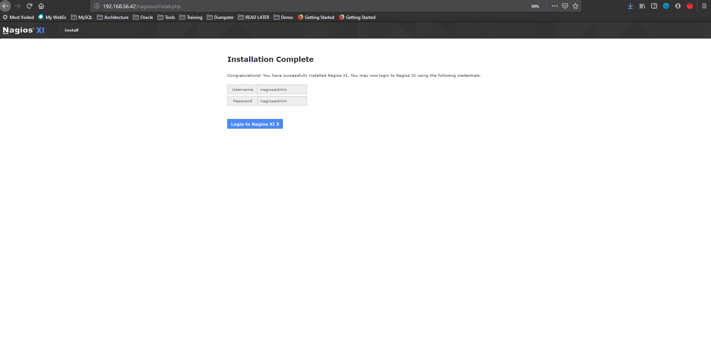
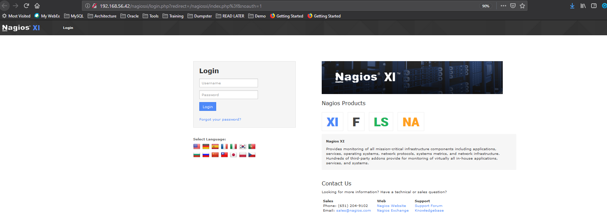
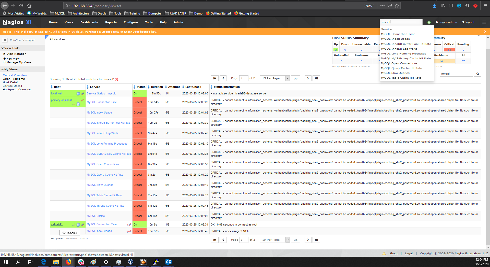
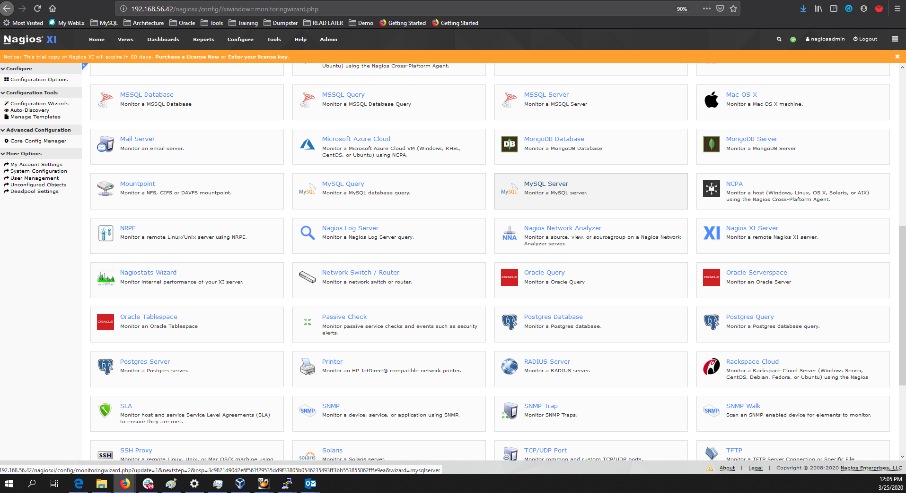
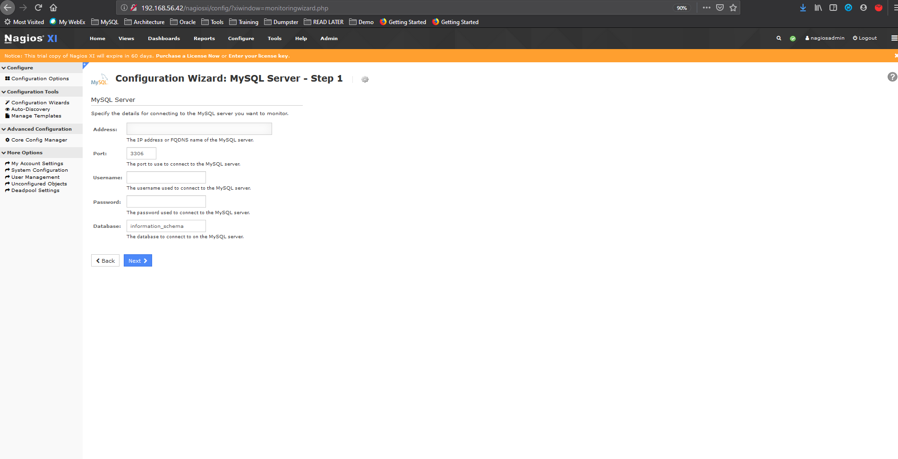
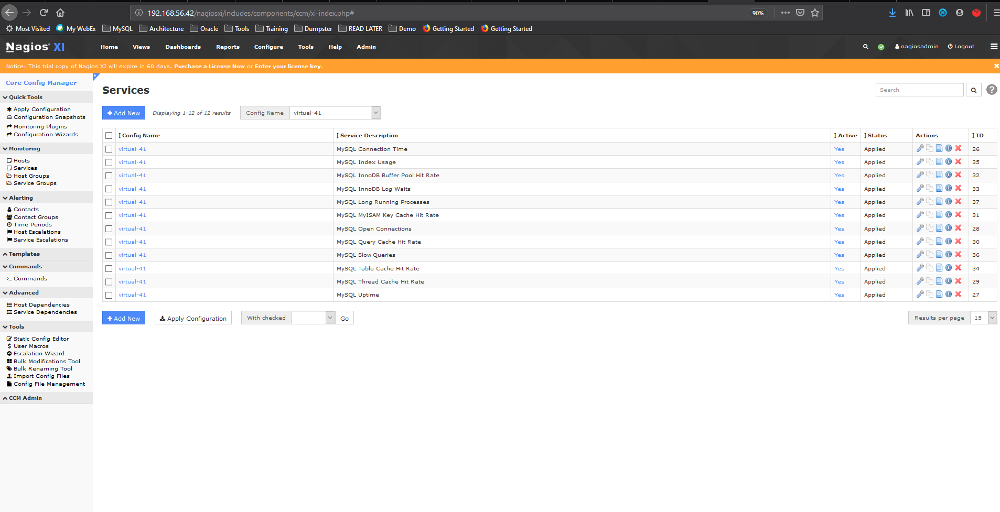

# Using Nagios with MySQL
Nagios is a popular system monitoring tools for enterprise infrastructure management and monitoring. 
MySQL is one of the components tha Nagios can monitor

## Install Nagios
Download the trial version of Nagios XI from https://www.nagios.org/downloads/. Nagios offers **Nagios Core** (Open Source version) 
and **Nagios XI** (Commercial). For simplicity, I am using Nagios XI.
The installation of Nagios XI takes a fair bit of time. Once installed, you will access the Web UI http://192.168.56.42/nagiosxi
to complete the installation

Once the user/password is configured, you can start using Nagios to monitor MySQL

## Configure MySQL
On Nagios UI, select **Configure**->**Configuration Wizard**
Select the **MySQL Server** and fill up the details

Once configured, you can start monitoring MySQL by navigating the different metrics

In comparison with MySQL Enterprise Monitor (MEM), MEM provides both InnoDB and NDB Cluster views as well as Replication status that 
most people wants to monitor

