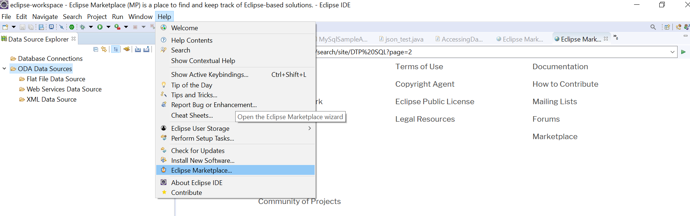
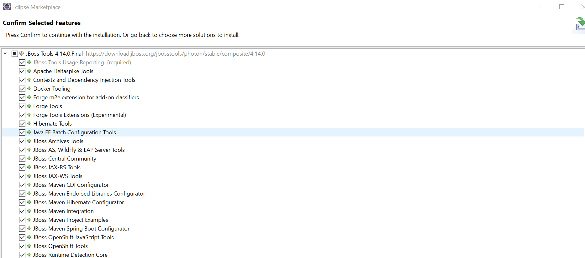

# Using Hibernate with MySQL
Prepare your eclipse environment to have the ""SQL development tools"" and ""JBoss Tools" installed

* Search marketplace for tools

* Install JBOSS which includes the hibernate tools

* Add MySQL Driver to Database Management

* Specifiy the mysql jdbc driver
* create the user account with ""mysql_native_password""

