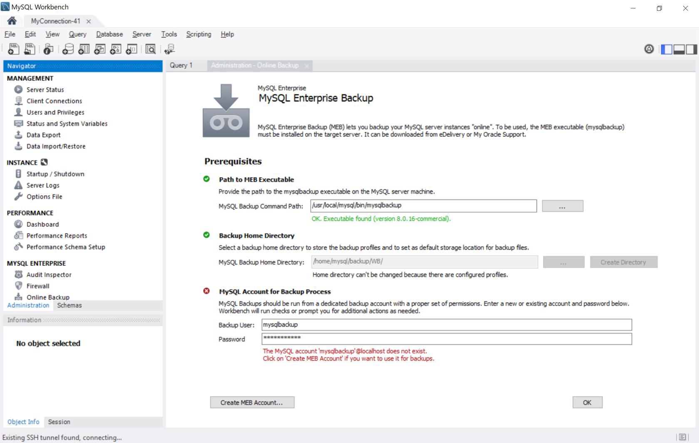
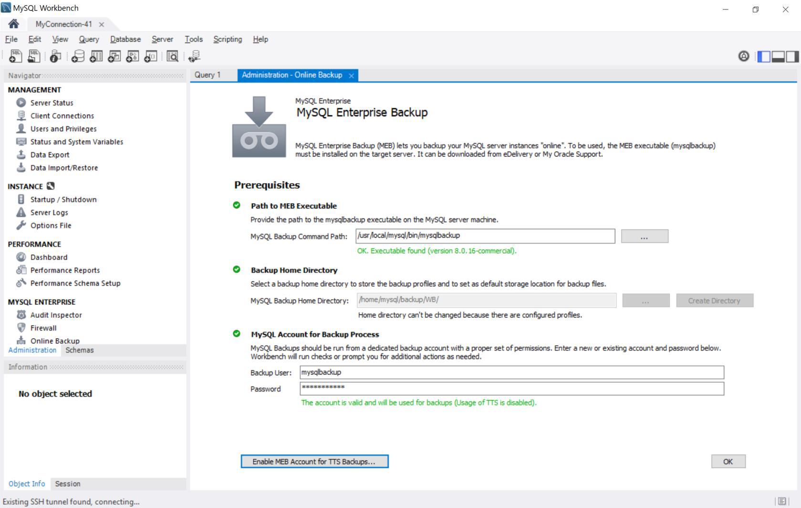

# MySQL Enterprise Backup
We will use MySQL Enterprise Backup to do backup and restore of MySQL database
## Using MySQL Enterprise Workbench to create backup
1. Start MyQL Enteprirse Workbench, select "Online Backup" on the left panel

2. Create MEB Account by select "Create MEB Account"

3. Create a backup schedule

4. once completed all the parameters, a cron job will be created

5. You can execute the schedule job to initiate the backup

