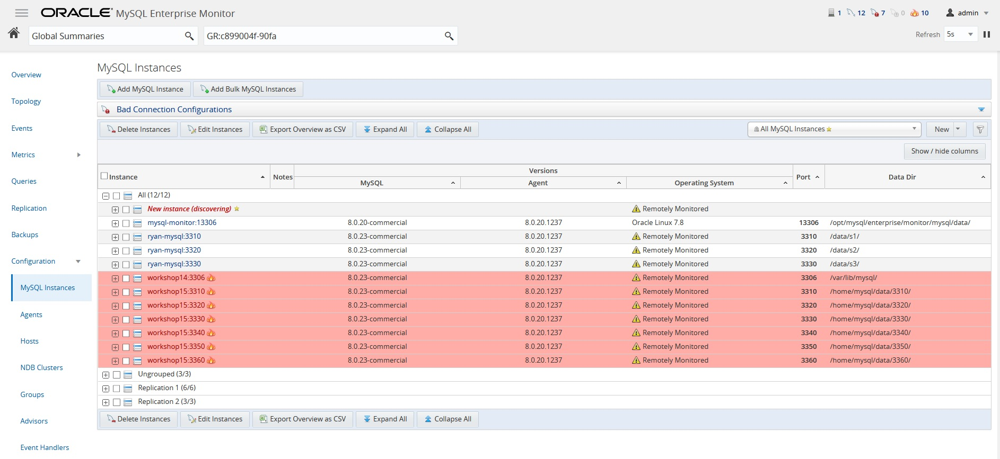
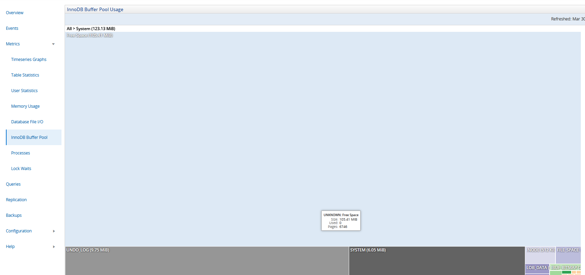
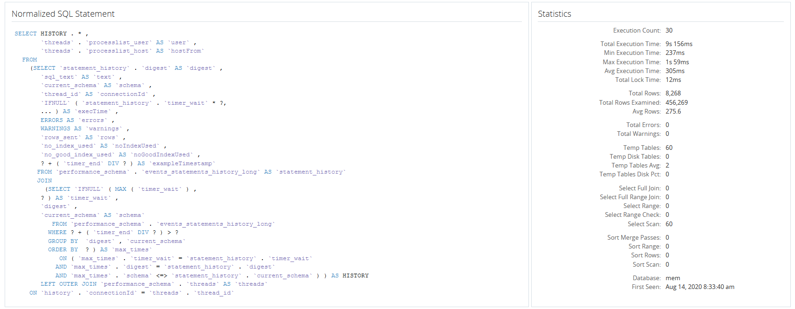
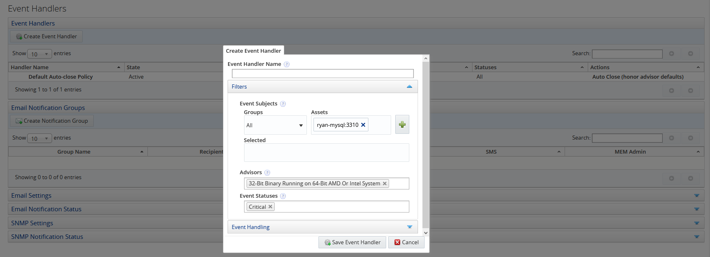

# MySQL Enterprise Monitor
In this lab, you will install MySQL Enterprise Monitor on MySQLnode2 (192.168.56.42) and learn how to monitor MySQL instances

## MySQL Enterprise Monitor Installation (MySQLnode2: 192.168.56.42)
1. Install MySQL server, MySQL Router, MySQL Shell
```
cd /opt/download/lab/01-install
cd 01-mysql-server
sudo ./05-installTar.sh
cd ../02-router
sudo ./installTar.sh
cd ../03-shell
sudo ./installTar.sh
```

2. Install MySQL Enterprise Monitor
```
cd /opt/download/mysql/mem8
sudo chmod +x ./*.bin
./mysqlmonitor-8.0.18-1217-linux-x86_64-installer.bin
```
Just hit "Enter"-key for all the question prompts except the password
```
password: mysql
```

3. Once installed, you can use your local browser to navigate to https://192.168.56.42:18443

4. Enter the following in the user fileds:
Create user with 'manager' role
```
Username: admin
Password: admin
```
Create user with 'agent' role
```
Username: agent
Password: agent
```


## Install MySQL Enteprise Monitor Agent (MySQLnode1: 192.168.56.41)
1. Install MySQL Enterprise Monitor Agent
```
cd /opt/download/mysql/mem8/
sudo chmod +x *.bin
./mysqlmonitoragent-8.0.18-linux-x86-64bit-installer-bin
```

Enter the following:
```
IP Address for the Monitor: 192.168.56.42
Port: <Enter>
Agent User: <Enter>
Password: agent
```


2. Start the agent
```
/home/mysql/mysql/enterprise/agent/bin/agent.sh &
```
Or
```
/home/mysql/mysql/enterprise/agent/etc/init.d/mysql-monitor-agent start
```

## What are you looking at in MySQL Enterprise Monitor (MEM)?

There is a lot of information in MEM, it can be overwhelming if you don't know what you are looking for or looking at. Let's expore what is available in MEM and how you can use MEM to help you understand MySQL better

### MEM Main Dashboard

The main dashboard displays the following information
1. A list of Timeseries graphs
2. MySQL instances monitored, problematic instances, hosts, and database activities
3. Critical events


### Events

You can check the Events tab for critical events for immediate remedy or actions


### Monitor MySQL instances

You will add new instances to MEM dashboard by specifying the hosts/ports of the MySQL instances to be added to MEM dashboard



Once the instance is added to MEM, you can then navigate the various configuration tabs to inspect the current configuration details of the monitored MySQL instance


### What are you looking for and looking at?

You can find lots of useful metrics by selecting the various metrics on the left panel of the MEM dashboard
* Timeseries Graph


* Table Statistics


* User Staticstics


* Memory Usage


* Database File I/O
** By File Type


** By Wait Type


** By Thread Type


* InnoDB Buffer Pool

You need to click on the **Generate Report** to see the InnoDB Buffer utilization




* Processes


* Lock Waits

Row Lock


Table Lock


## Query Analyzer

It is very common that users encountered slow response time when executing queries, you can turn to MEM to monitor slow running queries from time to time to fine tune the database to improve these slow running queries. MEM provides **Query Analyzer** to categorize slow running queries by color using **Query Response Time Index (QRTi)** in the following categories:
1. Less than 100ms (Green)
2. Between 100ms and 400ms (Yellow)
3. More than 400ms (Red)


You can drill into one of these queries for more details




## Replication

Besides standalone MySQL instances, you can also monitor MySQL replica and InnoDB Cluster


## Backups

You can also monitor the status of database backup


## Advisors

MEM comes bundled with more than 200 Advisors to monitor critical database events using a set of threadholds, you can create event handlers to define actions whenever any of these threadhold is breached, for example, trigger an email, SMTP traps to alert the DBA



