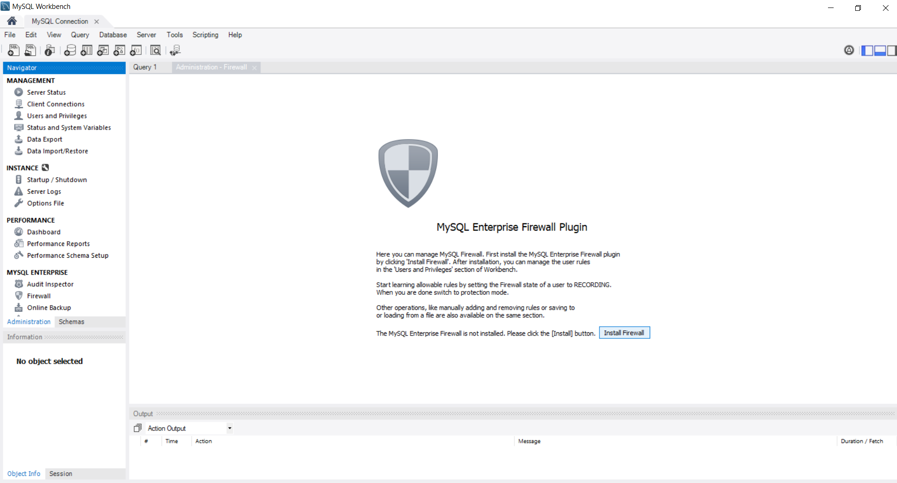
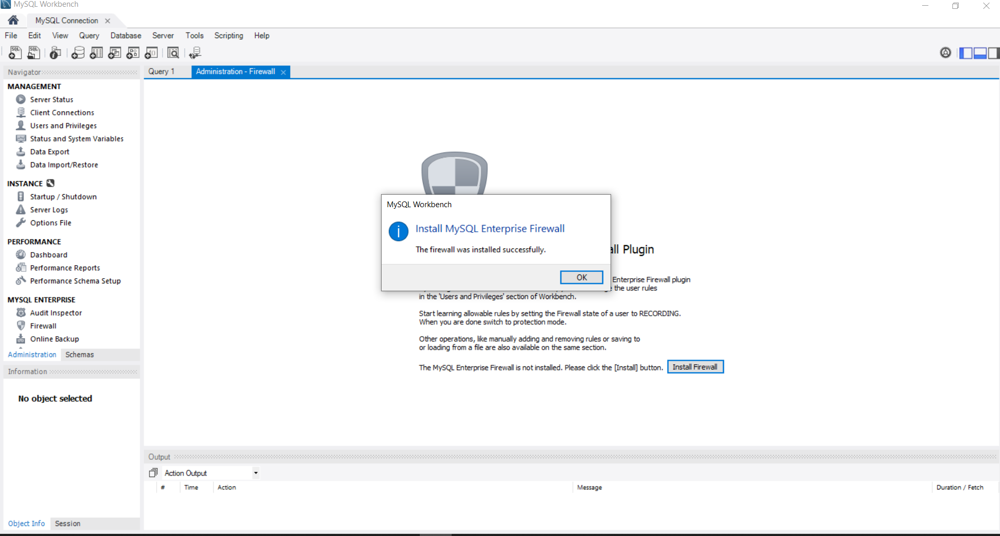
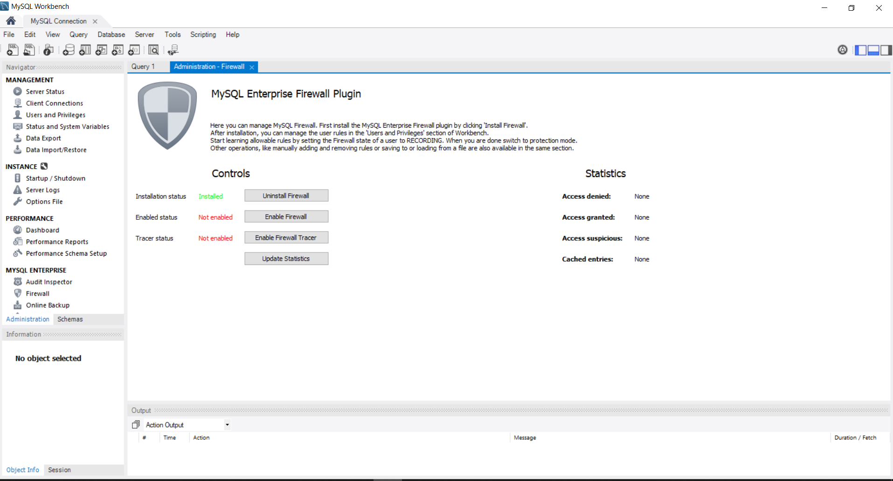
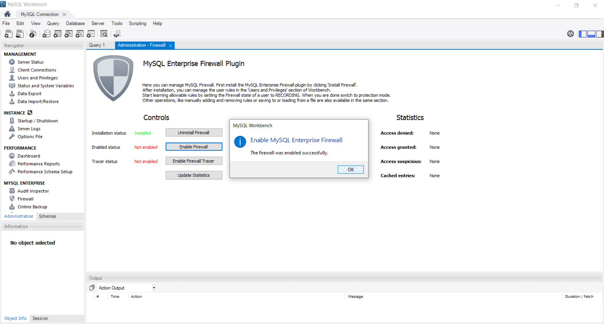
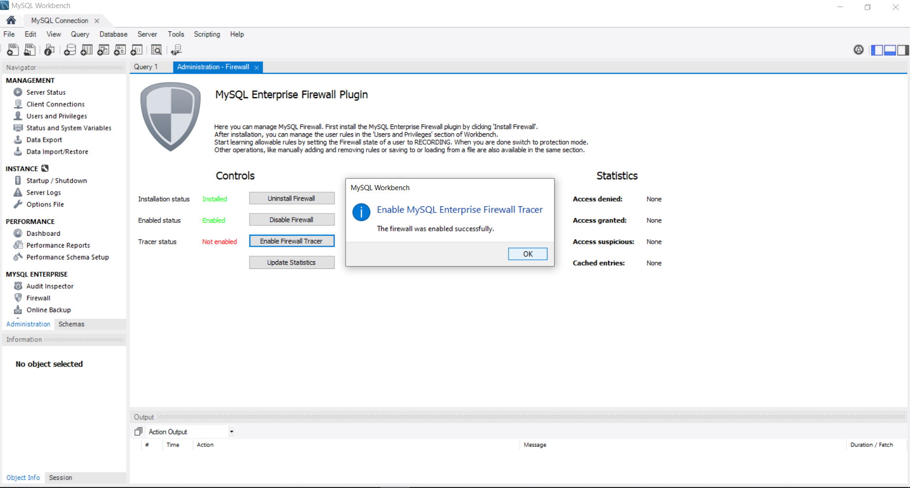
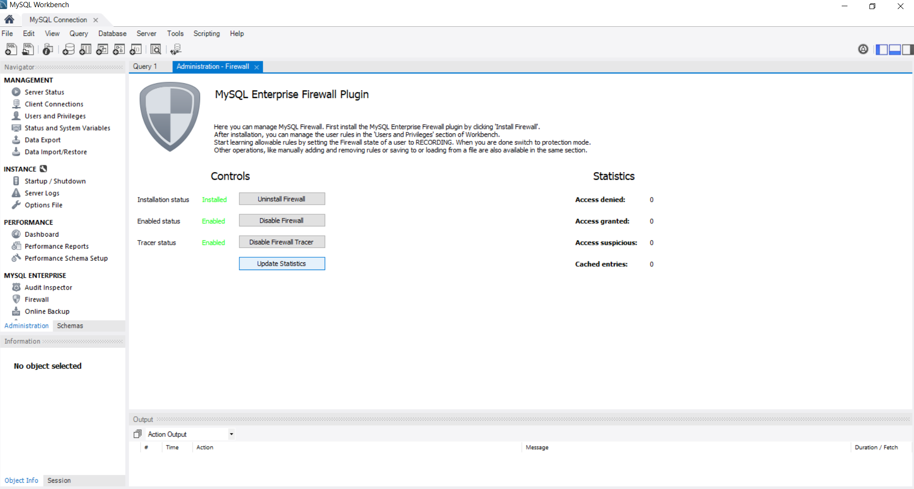
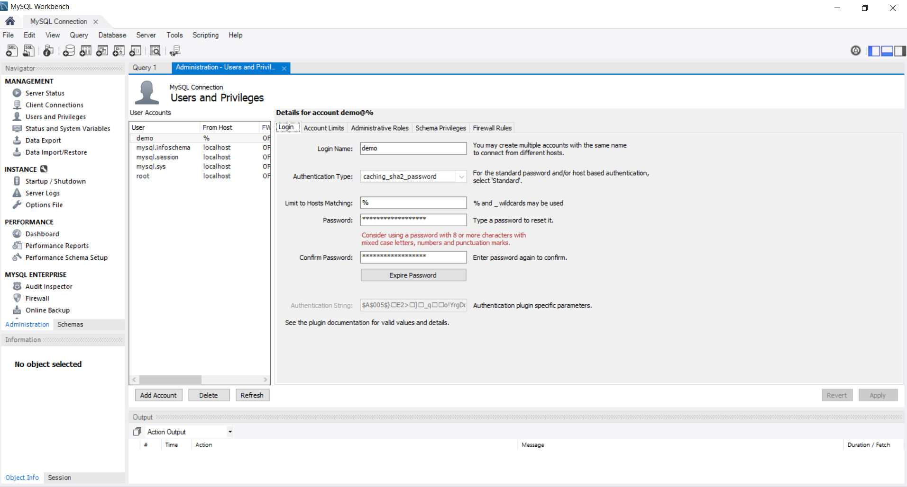
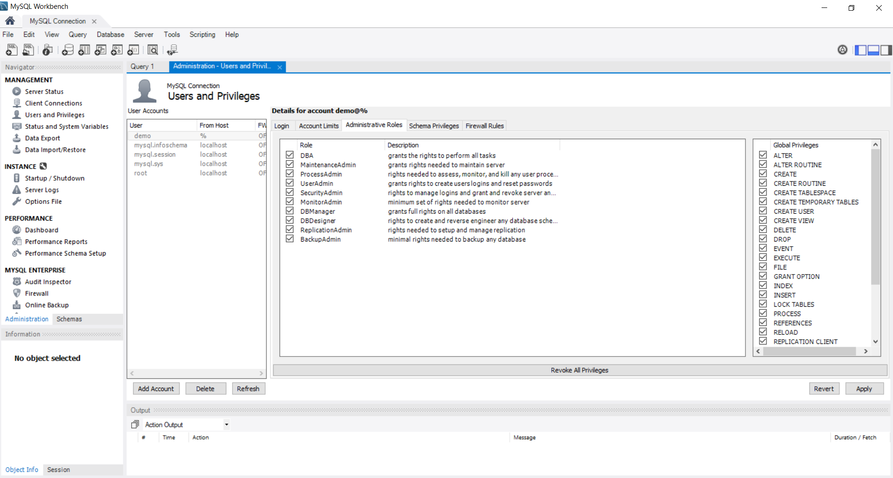
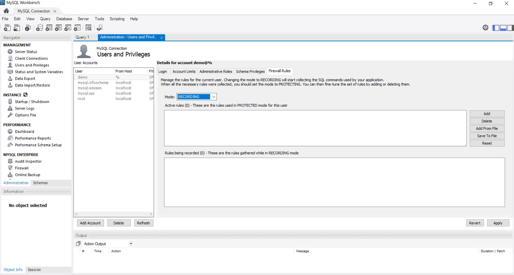
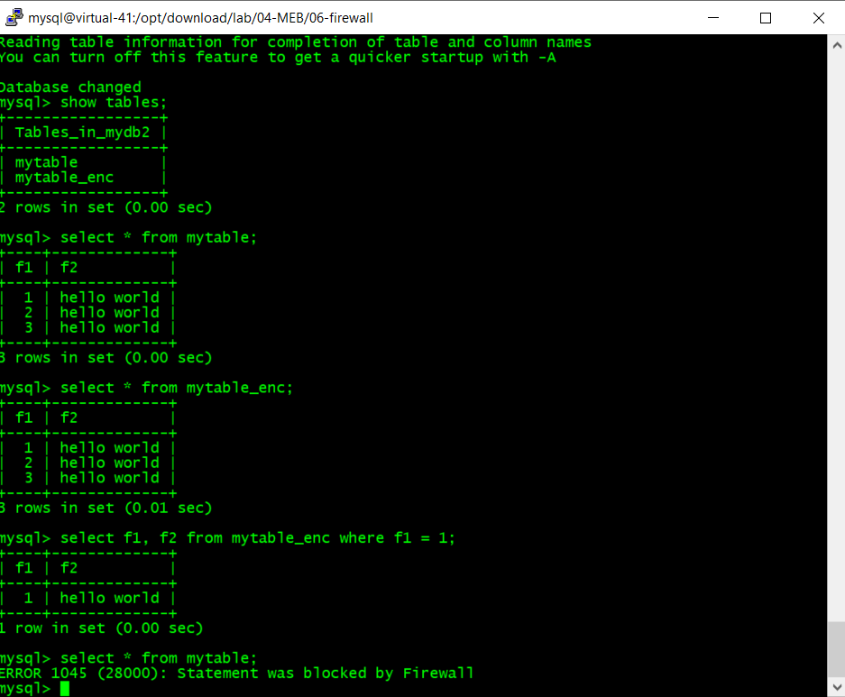

# MySQL Security (Transparent Data Encryption, Enterprise Firewall, Enterprise Audit)

## Transparent Data Encryption (TDE)
### Install the TDE plugin
We will be reusing the MySQL database in 02-Admin lab but with a few modification
```
cd /opt/download/lab/02-Admin
. ./comm.sh
mysqladmin -uroot -h127.0.0.1 -P3306 -p shutdown
cd /opt/download/lab/04-MEB/05-tde
. ./comm.sh
mysqld_safe --defaults-file=config/my1.cnf &
```
The TDE plugin configuration settings in my1.cnf
```
early-plugin-load=keyring_encrypted_file.so
keyring_encrypted_file_data=/home/mysql/data/3306/mysql-keyring/keyring-encrypted
keyring_encrypted_file_password=password
```
Examine the keyring-encrypted file
```
cd ~/data/3306/mysql-keyring/
ll
file keyring-encrypted
strings keyring-encrypted
hexdump keyring-encrypted
```

### Create encrypted tables
```
cd /opt/download/lab/04-MEB/05-tde
. ./comm.sh
./04-TDEtables.sh
```
Results
```
+------------------------+---------------+-------------+
| plugin_name            | plugin_status | load_option |
+------------------------+---------------+-------------+
| keyring_encrypted_file | ACTIVE        | ON          |
+------------------------+---------------+-------------+
+---------+----+-------------+
| mytable | f1 | f2          |
+---------+----+-------------+
| mytable |  1 | hello world |
| mytable |  2 | hello world |
| mytable |  3 | hello world |
+---------+----+-------------+
+-------------+----+-------------+
| mytable_enc | f1 | f2          |
+-------------+----+-------------+
| mytable_enc |  1 | hello world |
| mytable_enc |  2 | hello world |
| mytable_enc |  3 | hello world |
+-------------+----+-------------+
```
### Examine the table files
```
cd ~/data/3306/mydb2
strings mytable.ibd | more
strings mytable_enc.ibd | more
```

## MySQL Enterprise Firewall
We will use MySQL Workbench to work with Enterprise Firewall

### Install the Enterprise Firewall Plugin
Start MySQL Workbench using the connection profile created during VM preparation and click on "Install Firewall"


Once the firewall plugin is installed, enable the firewall and other features









Once everything is installed, click on "Update Statistics"



### Create a test demo user
Create a user called "demo", select authentication "caching_sha2_password", enter password that you like, click "Create"



Select the "Administrative Roles" tab, click on "DBA" role for simplicity reason



### Set the Firewall in "Recording" mode



### In another terminal, execute a few SQL statements using user "demo"

```
mysql -udemo -h127.0.0.1 -P3306 -p
```
mysql>
```
show databases;
use mydb2;
show tables;
select * from mytable;
select * from mytable_enc;
select f1, f2 from mytable_enc where f1=1;
```

Switch to Workbench
Change the "Recording" mode to "Protecting" mode
Select the statement "select * from mytable" and click on "Delete"
Click on "Protecting" mode
Click on "Apply"


Switch to Terminal again
mysql>
``` 
select * from mytable;
```
Firewall will block this SQL statement



### MySQL Enterprise Audit
We will first create a login-path to obfuscate the my.cnf configuration to secure the my.cnf configruation settings
#### Initialize the MySQL engine
```
mysqladmin -uroot -h127.0.0.1 -P3306 -p shutdown
cd /opt/download/lab/23-Security/secure-audit-filter/
. ./comm.sh
./00-createdb-secure.sh
./01-startdb.sh
./02-resetPasswd.sh
./03-addLoginPath.sh
```

#### Install Enterprise Audit plugin
```
./31-installAudit.sh
./32-createAuditUser.sh
./33-allLog-Filter.sh
```
#### Now run some SQL statements
```
. ./comm.sh
mysql -uaudituser1 -h127.0.0.1 
```
mysql>
```
use auditdb1;
create table audittable1 (val int not null primary key);
insert into audittable1 values (1);

select count(*) from audittable1;
select count(*) from mysql.user;
use mysql;
select count(*) from user;
\q
```
#### Examine audit.log
```
tail -100 ~/data/lab23/audit.log
```

#### Reset the audit configuration
```
/opt/download/lab/23-Security/secure-audit-filter/35-testAllLog-disabled.sh
/opt/download/lab/23-Security/secure-audit-filter/39-cleanupAuditFilters.sh
```

### MySQL Enterprise Audit (Manual Install)

```
mysql -u root -p < audit_log_filter_linux_install.sql

[mysqld]
audit-log=FORCE_PLUS_PERMANENT

```

#### Log all user activities

```
SELECT audit_log_filter_set_filter('log_all', '{ "filter": { "log": true } }');
SELECT audit_log_filter_set_user('%', 'log_all');
```

#### Uninstall

```
DROP TABLE IF EXISTS mysql.audit_log_user;
DROP TABLE IF EXISTS mysql.audit_log_filter;
UNINSTALL PLUGIN audit_log;
DROP FUNCTION audit_log_filter_set_filter;
DROP FUNCTION audit_log_filter_remove_filter;
DROP FUNCTION audit_log_filter_set_user;
DROP FUNCTION audit_log_filter_remove_user;
DROP FUNCTION audit_log_filter_flush;
DROP FUNCTION audit_log_encryption_password_get;
DROP FUNCTION audit_log_encryption_password_set;
DROP FUNCTION audit_log_read;
DROP FUNCTION audit_log_read_bookmark;
```

# Enterprise Data Masking

```
INSTALL PLUGIN data_masking SONAME 'data_masking.so';
CREATE FUNCTION gen_blacklist RETURNS STRING
  SONAME 'data_masking.so';
CREATE FUNCTION gen_dictionary RETURNS STRING
  SONAME 'data_masking.so';
CREATE FUNCTION gen_dictionary_drop RETURNS STRING
  SONAME 'data_masking.so';
CREATE FUNCTION gen_dictionary_load RETURNS STRING
  SONAME 'data_masking.so';
CREATE FUNCTION gen_range RETURNS INTEGER
  SONAME 'data_masking.so';
CREATE FUNCTION gen_rnd_email RETURNS STRING
  SONAME 'data_masking.so';
CREATE FUNCTION gen_rnd_pan RETURNS STRING
  SONAME 'data_masking.so';
CREATE FUNCTION gen_rnd_ssn RETURNS STRING
  SONAME 'data_masking.so';
CREATE FUNCTION gen_rnd_us_phone RETURNS STRING
  SONAME 'data_masking.so';
CREATE FUNCTION mask_inner RETURNS STRING
  SONAME 'data_masking.so';
CREATE FUNCTION mask_outer RETURNS STRING
  SONAME 'data_masking.so';
CREATE FUNCTION mask_pan RETURNS STRING
  SONAME 'data_masking.so';
CREATE FUNCTION mask_pan_relaxed RETURNS STRING
  SONAME 'data_masking.so';
CREATE FUNCTION mask_ssn RETURNS STRING
  SONAME 'data_masking.so';
```

## Unnstall

```
UNINSTALL PLUGIN data_masking;
DROP FUNCTION gen_blacklist;
DROP FUNCTION gen_dictionary;
DROP FUNCTION gen_dictionary_drop;
DROP FUNCTION gen_dictionary_load;
DROP FUNCTION gen_range;
DROP FUNCTION gen_rnd_email;
DROP FUNCTION gen_rnd_pan;
DROP FUNCTION gen_rnd_ssn;
DROP FUNCTION gen_rnd_us_phone;
DROP FUNCTION mask_inner;
DROP FUNCTION mask_outer;
DROP FUNCTION mask_pan;
DROP FUNCTION mask_pan_relaxed;
DROP FUNCTION mask_ssn;
```

## Examples

```
SELECT mask_inner('This is a string', 5, 1);
SELECT mask_inner('This is a string', 1, 5);
SELECT mask_inner('This is a string', 5, 1, '*');
SELECT mask_outer('This is a string', 5, 1);
SELECT mask_outer('This is a string', 1, 5);
SELECT mask_outer('This is a string', 5, 1, '#');
SELECT mask_pan(gen_rnd_pan());
SELECT mask_pan_relaxed(gen_rnd_pan());
SELECT gen_range(1, 10);
SELECT gen_rnd_email();

select s.emp_no, e.last_name, e.first_name, mask_inner(cast(salary as char), 0, 2) as salary from employees.salaries s, employees.employees e where s.emp_no=e.emp_no limit 50;
```


