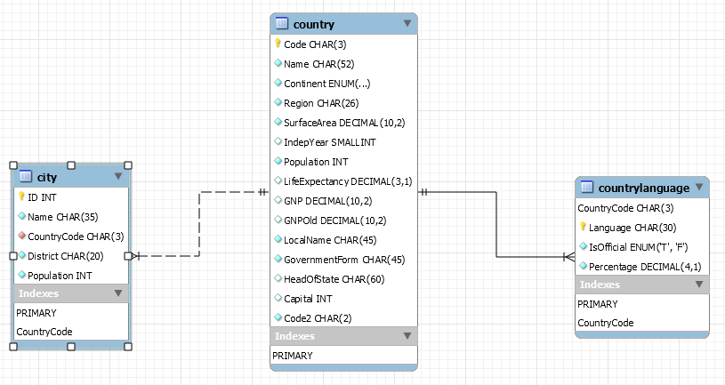

# Query Optimizer

## Using EXPLAIN

Get a list of Europe cities sorted by its size and population
```
SELECT ci.ID, ci.Name, ci.District,
       co.Name AS Country, ci.Population
  FROM world.city ci
       INNER JOIN
         (SELECT Code, Name
            FROM world.country
           WHERE Continent = 'Europe'
           ORDER BY SurfaceArea
           LIMIT 10
         ) co ON co.Code = ci.CountryCode
 ORDER BY ci.Population DESC
 LIMIT 5;
 
 +------+------------------------------------+-------------------+------------+------------+
| ID   | Name                               | District          | Country    | Population |
+------+------------------------------------+-------------------+------------+------------+
| 3212 | Ljubljana                          | Osrednjeslovenska | Slovenia   |     270986 |
| 3213 | Maribor                            | Podravska         | Slovenia   |     115532 |
| 2452 | Luxembourg [Luxemburg/Lëtzebuerg]  | Luxembourg        | Luxembourg |      80700 |
|  915 | Gibraltar                          | –                 | Gibraltar  |      27025 |
| 2483 | Birkirkara                         | Outer Harbour     | Malta      |      21445 |
+------+------------------------------------+-------------------+------------+------------+
5 rows in set (0.00 sec)

```

## EXPLAIN (traditional)

* derived2 table refers to subquery
* EXTRA shows 
```

 EXPLAIN FORMAT=TRADITIONAL
       SELECT ci.ID, ci.Name, ci.District,
              co.Name AS Country, ci.Population
         FROM world.city ci
              INNER JOIN
                (SELECT Code, Name
                   FROM world.country
                  WHERE Continent = 'Europe'
                  ORDER BY SurfaceArea
                  LIMIT 10
                ) co ON co.Code = ci.CountryCode
        ORDER BY ci.Population DESC
        LIMIT 5\G
  *************************** 1. row ***************************
           id: 1
  select_type: PRIMARY
        table: <derived2>
   partitions: NULL
         type: ALL
possible_keys: NULL
          key: NULL
      key_len: NULL
          ref: NULL
         rows: 10
     filtered: 100.00
        Extra: Using temporary; Using filesort
*************************** 2. row ***************************
           id: 1
  select_type: PRIMARY
        table: ci
   partitions: NULL
         type: ref
possible_keys: CountryCode
          key: CountryCode
      key_len: 12
          ref: co.Code
         rows: 17
     filtered: 100.00
        Extra: NULL
*************************** 3. row ***************************
           id: 2
  select_type: DERIVED
        table: country
   partitions: NULL
         type: ALL
possible_keys: NULL
          key: NULL
      key_len: NULL
          ref: NULL
         rows: 239
     filtered: 14.29
        Extra: Using where; Using filesort
3 rows in set, 1 warning (0.00 sec)

*************************** 1. row ***************************
  Level: Note
   Code: 1003
Message: /* select#1 */ select `world`.`ci`.`ID` AS `ID`,`world`.`ci`.`Name` AS `Name`,`world`.`ci`.`District` AS `District`,`co`.`Name` AS `Country`,`world`.`ci`.`Population` AS `Population` from `world`.`city` `ci` join (/* select#2 */ select `world`.`country`.`Code` AS `Code`,`world`.`country`.`Name` AS `Name` from `world`.`country` where (`world`.`country`.`Continent` = 'Europe') order by `world`.`country`.`SurfaceArea` limit 10) `co` where (`world`.`ci`.`CountryCode` = `co`.`Code`) order by `world`.`ci`.`Population` desc limit 5
1 row in set (0.00 sec)
```


## EXPLAIN (json)

json format provides additional information  

* cost_info on query cost
* join types: nested loop join
* could be difficult to read (use Visual Explain)

```  
EXPLAIN FORMAT=JSON
       SELECT ci.ID, ci.Name, ci.District,
              co.Name AS Country, ci.Population
         FROM world.city ci
              INNER JOIN
                (SELECT Code, Name
                   FROM world.country
                  WHERE Continent = 'Europe'
                  ORDER BY SurfaceArea
                  LIMIT 10
                ) co ON co.Code = ci.CountryCode
        ORDER BY ci.Population DESC
        LIMIT 5\G
 *************************** 1. row ***************************
EXPLAIN: {
  "query_block": {
    "select_id": 1,
    "cost_info": {
      "query_cost": "337.16"
    },
    "ordering_operation": {
      "using_temporary_table": true,
      "using_filesort": true,
      "cost_info": {
        "sort_cost": "174.40"
      },
      "nested_loop": [
        {
          "table": {
            "table_name": "co",
            "access_type": "ALL",
            "rows_examined_per_scan": 10,
            "rows_produced_per_join": 10,
            "filtered": "100.00",
            "cost_info": {
              "read_cost": "2.62",
              "eval_cost": "1.00",
              "prefix_cost": "3.62",
              "data_read_per_join": "2K"
            },
            "used_columns": [
              "Code",
              "Name"
            ],
            "materialized_from_subquery": {
              "using_temporary_table": true,
              "dependent": false,
              "cacheable": true,
              "query_block": {
                "select_id": 2,
                "cost_info": {
                  "query_cost": "25.65"
                },
                "ordering_operation": {
                  "using_filesort": true,
                  "table": {
                    "table_name": "country",
                    "access_type": "ALL",
                    "rows_examined_per_scan": 239,
                    "rows_produced_per_join": 34,
                    "filtered": "14.29",
                    "cost_info": {
                      "read_cost": "22.24",
                      "eval_cost": "3.41",
                      "prefix_cost": "25.65",
                      "data_read_per_join": "32K"
                    },
                    "used_columns": [
                      "Code",
                      "Name",
                      "Continent",
                      "SurfaceArea"
                    ],
                    "attached_condition": "(`world`.`country`.`Continent` = 'Europe')"
                  }
                }
              }
            }
          }
        },
        {
          "table": {
            "table_name": "ci",
            "access_type": "ref",
            "possible_keys": [
              "CountryCode"
            ],
            "key": "CountryCode",
            "used_key_parts": [
              "CountryCode"
            ],
            "key_length": "12",
            "ref": [
              "co.Code"
            ],
            "rows_examined_per_scan": 17,
            "rows_produced_per_join": 174,
            "filtered": "100.00",
            "cost_info": {
              "read_cost": "141.70",
              "eval_cost": "17.44",
              "prefix_cost": "162.76",
              "data_read_per_join": "42K"
            },
            "used_columns": [
              "ID",
              "Name",
              "CountryCode",
              "District",
              "Population"
            ]
          }
        }
      ]
    }
  }
}
1 row in set, 1 warning (0.00 sec)
```

## EXPLAIN (tree)

Easy to read  

* read from inside -> out
* Good overview

```
EXPLAIN FORMAT=TREE
       SELECT ci.ID, ci.Name, ci.District,
              co.Name AS Country, ci.Population
         FROM world.city ci
              INNER JOIN
                (SELECT Code, Name
                   FROM world.country
                  WHERE Continent = 'Europe'
                  ORDER BY SurfaceArea
                  LIMIT 10
                ) co ON co.Code = ci.CountryCode
        ORDER BY ci.Population DESC
        LIMIT 5\G
        
*************************** 1. row ***************************
EXPLAIN: -> Limit: 5 row(s)
    -> Sort: world.ci.Population DESC, limit input to 5 row(s) per chunk
        -> Stream results
            -> Nested loop inner join
                -> Table scan on co
                    -> Materialize
                        -> Limit: 10 row(s)
                            -> Sort: world.country.SurfaceArea, limit input to 10 row(s) per chunk  (cost=25.65 rows=239)
                                -> Filter: (world.country.Continent = 'Europe')
                                    -> Table scan on country
                -> Index lookup on ci using CountryCode (CountryCode=co.`Code`)  (cost=14.34 rows=17)

1 row in set (0.00 sec)
        
```

## EXPLAIN ANALYZE

Additional information to **tree** output

* cost
* number of rows
* actual statistics

```
EXPLAIN ANALYZE
       SELECT ci.ID, ci.Name, ci.District,
              co.Name AS Country, ci.Population
         FROM world.city ci
              INNER JOIN
                (SELECT Code, Name
                   FROM world.country
                  WHERE Continent = 'Europe'
                  ORDER BY SurfaceArea
                  LIMIT 10
                ) co ON co.Code = ci.CountryCode
        ORDER BY ci.Population DESC
        LIMIT 5\G
        
EXPLAIN: -> Limit: 5 row(s)  (actual time=0.630..0.632 rows=5 loops=1)
    -> Sort: world.ci.Population DESC, limit input to 5 row(s) per chunk  (actual time=0.629..0.631 rows=5 loops=1)
        -> Stream results  (actual time=0.497..0.609 rows=15 loops=1)
            -> Nested loop inner join  (actual time=0.496..0.601 rows=15 loops=1)
                -> Table scan on co  (actual time=0.001..0.003 rows=10 loops=1)
                    -> Materialize  (actual time=0.472..0.475 rows=10 loops=1)
                        -> Limit: 10 row(s)  (actual time=0.453..0.458 rows=10 loops=1)
                            -> Sort: world.country.SurfaceArea, limit input to 10 row(s) per chunk  (cost=25.65 rows=239) (actual time=0.452..0.455 rows=10 loops=1)
                                -> Filter: (world.country.Continent = 'Europe')  (actual time=0.129..0.386 rows=46 loops=1)
                                    -> Table scan on country  (actual time=0.119..0.293 rows=239 loops=1)
                -> Index lookup on ci using CountryCode (CountryCode=co.`Code`)  (cost=14.34 rows=17) (actual time=0.011..0.012 rows=2 loops=10)
```

1 row in set (0.00 sec)





        
   
 
