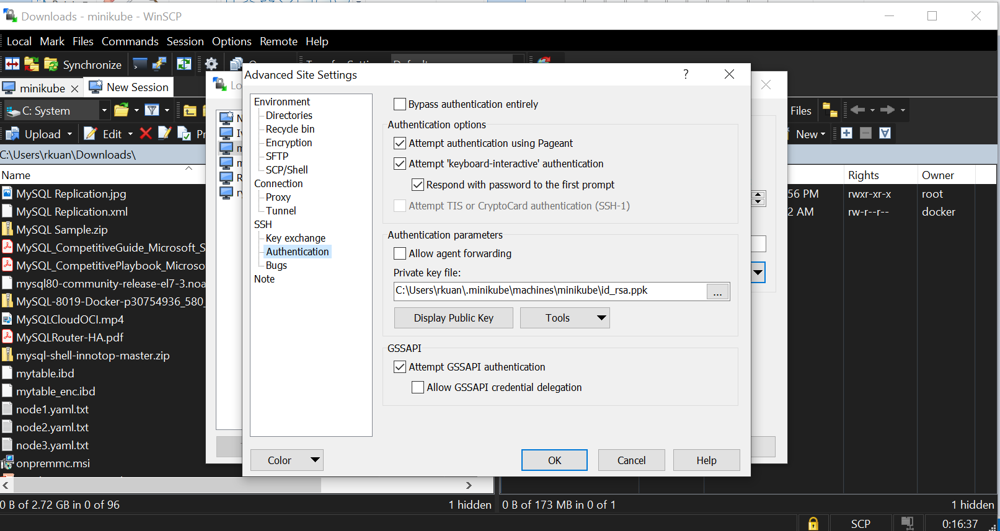

# MySQL InnoDB Cluster on Kubernetes (minikube)
In this lab, we will use minikube to deploy MySQL InnoDB cluster. THe following guide is for **Windows** but the steps are similar on other platforms such as Linux or MacOS
## Install Kubernetes
### Install kubectl
On Windows, install kubectl using the following guide:
https://kubernetes.io/docs/tasks/tools/install-kubectl/#install-kubectl-on-windows
Essentially, just download the **kubetcl** to your Windows
### Install Virtualbox
Install Oracle Virtualbox on your Windows by downloading Virtualbox from https://www.virtualbox.org/wiki/Downloads
### Install minikube
Install minikube from https://kubernetes.io/docs/tasks/tools/install-minikube/
You can either use the installer to download the latest minikube binaries or download the binaries directly. Rename the downloaded minikube binaries to **minikube.exe**
## Start minikube
Once you have downloaded the minikube, start up the minikube. This will create a minikube VM in Virtualbox
```
minikube start --cpus 4 --memory 4096
```
## Install MySQL Docker
Download the latest MySQL EE Docker image from support.oracle.com (with a valid Oracle support ID)


Search for the MySQL Docker Image


Once you have downloaded the docker image, upload the image to minikube VM.
Find out the minikube IP address (this IP is dynamic so each time the VM is restarted, different IP will be assigned), the minikube configuration is kept in your user directory
```
notepad \\users\\your_name\\.minikube\\machines\\minikube\\config.json
```
```
"Driver": {
        "IPAddress": "192.168.99.103",
```
You need to specify the IP address, private key (id_rsa) and user name **docker** to upload the doker image to the minikube VM

Use Winscp to transfer the downloaded MySQL docker image to minikube VM


Once you have uploaded the VM, you need to import the MySQL container by putty into the VM
```
unzip MySQL-8019-p30754936_580_Linux-x86-64.zip
docker load -i mysql-enterprise-server-8.0.19.tar
docker images
```


## Install MySQL Router
After you have loaded the MySQL docker image, install mysql router
```
docker pull mysql/mysql-router
docker images
```


### Prepare MySQL datadir
Next, create datadir for the 3 MySQL servers
```
sudo mkdir -p /data/backup/mysql-0 /data/backup/mysql-1 /data/backup/mysql-2 /data/db/mysql-0 /data/db/mysql-1 /data/db/mysql-2
sudo chown -Rf docker:docker /data
chmod -Rf ugo+xwr /data
```
## Create MySQL InnoDB cluster namespace
On your Windows, create the **mysql-cluster**
```
kubectl create ns mysql-cluster
```
Next, create the Persistent Volume
```
kubectl apply -f pvc-create.yaml
kubectl apply -f pv-create.yaml
```


List the Persistent Volume created
```
kubectl -n mysql-cluster get pv
```


Create secret setting for mysql root password ("root", this would be encoded in base64 format)
```
kubectl apply -f secret.yaml
```

Check the created secret
```
kubectl -n mysql-cluster get secret
```


Create the 3 nodes 
```
kubectl apply -f node1.yaml
kubectl apply -f node2.yaml
kubectl apply -f node3.yaml
kubectl apply -f service.yaml
kubectl -n mysql-cluster get pod
```

Once all the nodes are up and running, we are ready to configure the MySQL InnoDB cluster

```
kubectl -n mysql-cluster exec -it mysql-0-6fd46fdb9b-fb52c -- mysqlsh -- dba configure-instance { --socket=/var/lib/mysql/mysql.sock --user=root --password=root } --clusterAdmin=gradmin --clusterAdminPassword=grpass --restart=true --interactive=true
```
Repeat this for the 2 other instances
```
Configuring local MySQL instance listening at port 3306 for use in an InnoDB cluster...

This instance reports its own address as mysql-0:3306
Clients and other cluster members will communicate with it through this address by default. If this is not correct, the report_host MySQL system variable should be changed.
Assuming full account name 'gradmin'@'%' for gradmin

NOTE: Some configuration options need to be fixed:
+--------------------------+---------------+----------------+--------------------------------------------------+
| Variable                 | Current Value | Required Value | Note                                             |
+--------------------------+---------------+----------------+--------------------------------------------------+
| binlog_checksum          | CRC32         | NONE           | Update the server variable                       |
| enforce_gtid_consistency | OFF           | ON             | Update read-only variable and restart the server |
| gtid_mode                | OFF           | ON             | Update read-only variable and restart the server |
| server_id                | 1             | <unique ID>    | Update read-only variable and restart the server |
+--------------------------+---------------+----------------+--------------------------------------------------+

Some variables need to be changed, but cannot be done dynamically on the server.
Do you want to perform the required configuration changes? [y/n]: y

Cluster admin user 'gradmin'@'%' created.
Configuring instance...
The instance 'mysql-0:3306' was configured to be used in an InnoDB cluster.
Restarting MySQL...
ERROR: Remote restart of MySQL server failed: MySQL Error 3707 (HY000): Restart server failed (mysqld is not managed by supervisor process).
Please restart MySQL manually
```
You should see an error saying the MySQL can not be restarted, you can restart the pod
```
kubectl -n mysql-cluster delete pod mysql-0-5465d4b6bd-cfsgh
```

Before we start building the InnoDB cluster, we need to make sure that **all** the ip addresses of the pods are listed in the /etc/hosts file.

First of all, connect to mysql-0 to create the cluster, followed by adding mysql-1 and mysql-2 instances.
```
kubectl -n mysql-cluster exec -it mysql-0-5465d4b6bd-cfsgh -- mysqlsh gradmin@localhost:3306 --password=grpass -- dba create-cluster myCluster
```


Next, continue with the InnoDB cluster creation by adding mysql-1 and mysql-2 instances to the cluster
```
kubectl -n mysql-cluster exec -it mysql-0-5465d4b6bd-cfsgh -- mysqlsh gradmin:grpass@localhost:3306 -- cluster add-instance gradmin@mysql-1:3306 --password=grpass --recoveryMethod=clone

kubectl -n mysql-cluster exec -it mysql-0-5465d4b6bd-cfsgh -- mysqlsh gradmin:grpass@localhost:3306 -- cluster add-instance gradmin@mysql-2:3306 --password=grpass --recoveryMethod=clone
```
Finally, your InnoDB cluster should be up and running
```
kubectl -n mysql-cluster exec -it mysql-0-5465d4b6bd-cfsgh -- mysqlsh gradmin:grpass@localhost:3306 -- cluster status
```
Done

! Common Kubectl commands

```
kubectl -n mysql-cluster get pods, svc, deployments
```

```
minikube dashboard
```


