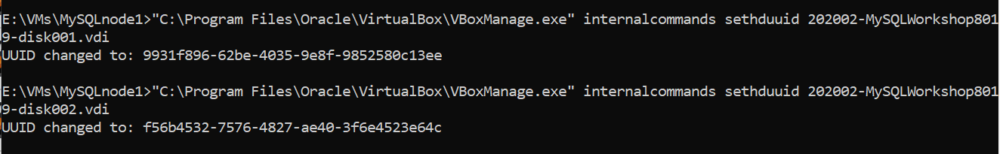
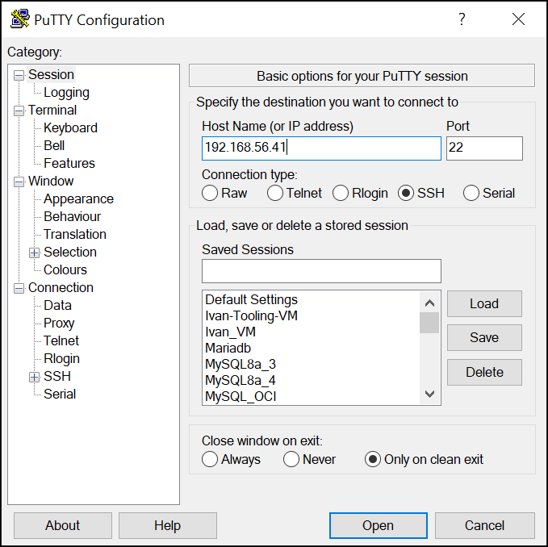
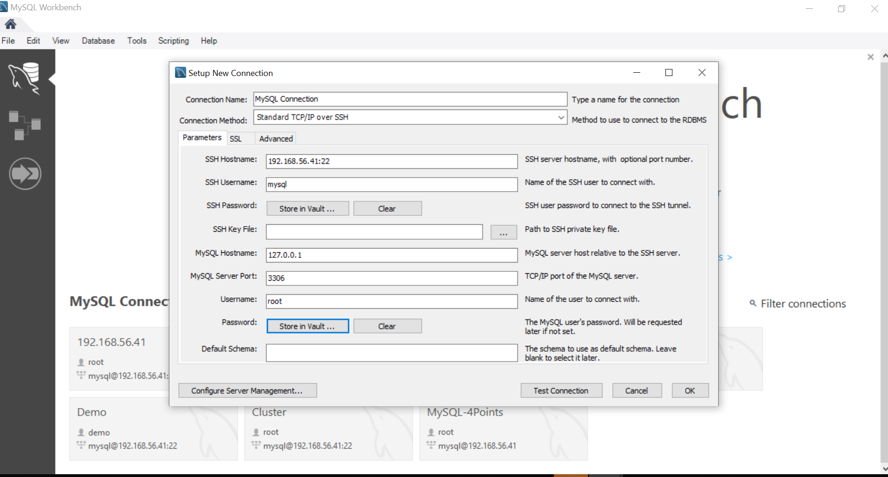
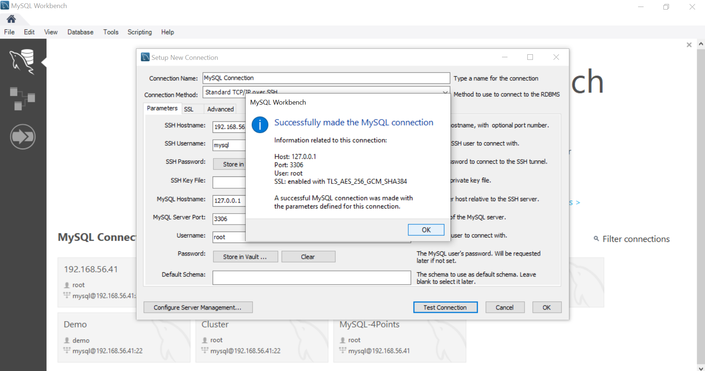

# VM Preparation
We will create 2 VMs by importing the OVA file provided in the lab

## Prerequisites Software
### Virtualbox
1. Install Oracle Virtualbox by downloading the latest Virtualbox from here: https://www.virtualbox.org/wiki/Downloads
2. Install the Virtualbox Extenstion Pack

### Putty (for Windows)
1. Install putty from here: https://www.chiark.greenend.org.uk/~sgtatham/putty/latest.html

## Create VMs
1. Once Virtualbox is installed, import the Virtualbox OVA file provided (202002-MySQLWorkshop8019.ova)


2. Change the following:
Name: MySQLnode1
Mac Address Policy: Generate new MAC addresses for all network adapters


3. Start importing by clicking on "Import"


4. Once the import completes, you should have the VM imported in Virtualbox in "Powered Off" mode

5. Repeat the same "Import" process to create the second VM and renamed to "MySQLnode2"

6. Connect to MySQLnode1 using putty


# Extra Bonus
In order to save space on your main drive, you can move the huge VM disk files to another drive, for example, an external hard disk

1. Remove the VM disk files from the VM


2. Copy the 2 disk files from your C:\ drive (usually stored in <user directory>\VirtualBox VMs\MySQLnode1\) to the external drive

3. You need to re-generate UUIDs of the moved disk file
```
"C:\Program Files\Oracle\VirtualBox\VBoxManage.exe" internalcommands sethduuid 202002-MySQLWorkshop8019-disk001.vdi
"C:\Program Files\Oracle\VirtualBox\VBoxManage.exe" internalcommands sethduuid 202002-MySQLWorkshop8019-disk002.vdi
```



4. Add the new location of the disk files back to the VM settings under SATA Controllers


5. Once the moved disk files are added back to the VM settings, you can start powering up the VM


6. Run putty to connect to 192.168.56.41 and you are ready to go (the first VM, MySQLnode1)
```
user id: mysql
password: mysql
```



# MySQL Workbench Installation
1. Install MySQL Workbench on your laptop

2. Configure connection to MySQLnode1



3. Test connection to make sure Workbench can connect to MySQL




